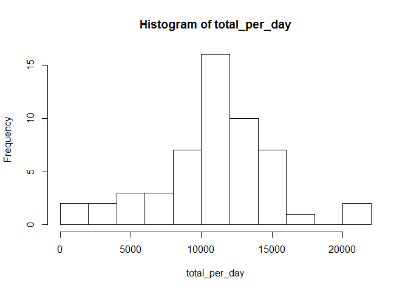

# Reproducible Research: Peer Assessment 1


## Loading and preprocessing the data :sheep:

```r
activity<-read.csv("activity.csv")
```

## What is mean total number of steps taken per day?

```r
total_per_day<-tapply(activity$steps,activity$date,sum)
mean_total<-round(mean(total_per_day,na.rm=TRUE),digits=2)
median_total<-median(total_per_day,na.rm=TRUE)
hist(total_per_day,breaks="FD")
```

 
  
The mean steps per day is 1.076619\times 10^{4} steps and the median of total steps per day is 10765 steps.

## What is the average daily activity pattern?


## Imputing missing values


## Are there differences in activity patterns between weekdays and weekends?
