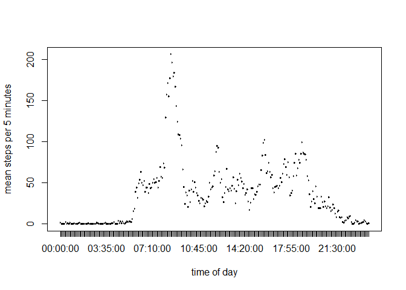
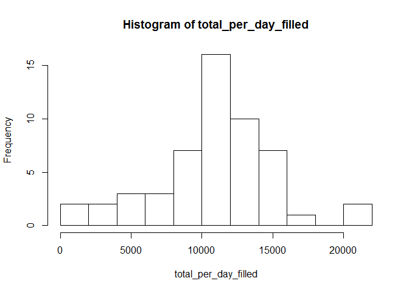
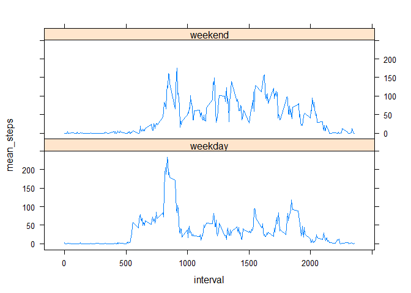

# Reproducible Research: Peer Assessment 1


## Loading and preprocessing the data :sheep:
Load the data and add a new variable called datetime with the full date and time of the interval.

```r
activity<-read.csv("activity.csv")

require(stringr)
require(plyr)
activity$interval<-str_sub(paste("000",activity$interval,sep=""),-4,-1)
activity<-mutate(activity,datetime=as.POSIXct(paste(activity$date,activity$interval),format=("%Y-%m-%d %H%M")))
```

## What is mean total number of steps taken per day?

```r
total_per_day<-tapply(activity$steps,activity$date,sum)
mean_total<-round(mean(total_per_day,na.rm=TRUE),digits=2)
median_total<-median(total_per_day,na.rm=TRUE)
hist(total_per_day,breaks="FD")
```

 
  
The mean steps per day is 1.0766\times 10^{4} steps and the median of total steps per day is 10765 steps.

## What is the average daily activity pattern?

```r
mean_per_interval<-tapply(activity$steps,activity$interval,mean,na.rm=TRUE)
times<-unique(strftime(activity$datetime,format="%H:%M:%S"))
max_time<-times[mean_per_interval==max(mean_per_interval)]
plot(as.data.frame(times),mean_per_interval,xlab="time of day",ylab="mean steps per 5 minutes",type="l")
```

 

The interval with the highest mean of steps is at 08:35:00.

## Imputing missing values

```r
missing_values<-is.na(activity$steps)
steps_filled<-activity$steps
long_mean_per_interval<-rep(mean_per_interval,length.out=length(steps_filled))
fill_data<-function(x) steps_filled[x]<-round(long_mean_per_interval[x])
replaced<-sapply(which(missing_values),fill_data)
activity_filled<-cbind(steps_filled,activity[2:4])

total_per_day_filled<-tapply(activity_filled$steps_filled,activity_filled$date,sum)
mean_total_filled<-mean(total_per_day_filled,na.rm=TRUE)
median_total_filled<-median(total_per_day_filled,na.rm=TRUE)
hist(total_per_day_filled,breaks="FD")
```

 

The total number of missing values is 2304. Missing values were replaced by the rounded mean of the corresponding interval. The mean and median of the new data set are then 1.0766189\times 10^{4} and 10765, identical to the original data set.

## Are there differences in activity patterns between weekdays and weekends?

```r
require(plyr)
```

```
## Loading required package: plyr
```

```
## Warning: package 'plyr' was built under R version 3.1.3
```

```r
require(reshape2)
```

```
## Loading required package: reshape2
```

```
## Warning: package 'reshape2' was built under R version 3.1.3
```

```r
activity<-mutate(activity,weekday=weekdays(datetime))
days<-cbind(c(rep("weekday",5),rep("weekend",2)),unique(activity$weekday))
activity<-mutate(activity,day=as.factor(mapvalues(weekday,days[,2],days[,1])))


mean_per_interval_per_day<-tapply(activity$steps,list(activity$interval,activity$day),mean,na.rm=TRUE)

mean_per_interval_per_day<-melt(mean_per_interval_per_day)
names(mean_per_interval_per_day)<-c("interval","day","mean_steps")

require(lattice)
```

```
## Loading required package: lattice
```

```
## Warning: package 'lattice' was built under R version 3.1.3
```

```r
xyplot(mean_steps ~ interval | day , data = mean_per_interval_per_day,layout=c(1,2),type="l")
```

 
